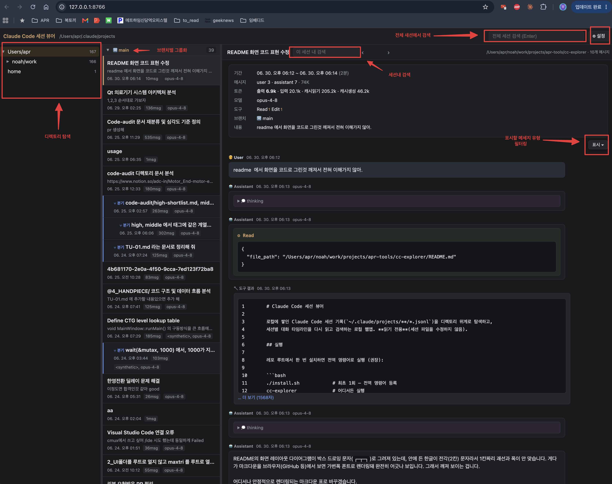

# Claude Code 세션 뷰어

로컬에 쌓인 Claude Code 세션 기록(`~/.claude/projects/**/*.jsonl`)을 디렉토리 위계로 탐색하고,
세션별 대화 타임라인을 다시 읽고 검색하는 로컬 웹앱. **읽기 전용**(세션 파일을 수정하지 않음).

## 실행

한 번 설치하면 전역 명령어로 실행 (권장). `install.py` 는 이 폴더(`cc-explorer/`)에 있다:

```bash
python3 install.py      # 이 폴더에서  (Windows: python install.py)
cc-explorer             # 어디서든 실행
```

설치 없이 직접 실행도 가능:

```bash
python3 server.py                 # macOS/Linux
python server.py                  # Windows (PowerShell)
```

- 표준 라이브러리만 사용 — 별도 설치 없음. macOS/Linux/Windows 동작.
- 실행하면 `http://127.0.0.1:8765/` 가 브라우저에서 자동으로 열린다.
- 포트가 쓰이고 있으면 8766, 8767… 로 자동 증가.
- 브라우저를 자동으로 열지 않으려면: `--no-open` 인자 추가.
- 종료: `Ctrl+C`

## 화면



좌·중·우 3분할 레이아웃이며, 우상단에 **전체 세션 검색** 바와 **설정**(⚙) 버튼이 있다.

- **좌 — 디렉토리 트리**: 각 세션의 실제 `cwd`로 디렉토리 위계를 구성(폴더 인코딩명이 아님). 노드별 세션 수 표시, 클릭하면 하위 포함 세션이 가운데 목록에.
- **중 — 세션 목록**: 최근 활동순. **브랜치(`🔀`)별 그룹화**, `↳ 분기`로 파생 세션 표시. 카드마다 제목(`aiTitle`), 마지막 프롬프트, 시각, 메시지 수, 모델 배지.
- **우 — 대화 타임라인**: 헤더에 세션 메타 요약(**세션ID**(**resume** 버튼) · 기간 · user/assistant 메시지 수 · 토큰(출력·입력·캐시읽기·캐시생성) · 모델 · 사용 도구 · 브랜치 · 첫 내용), `< >`로 세션 간 이동, **표시** 드롭다운으로 메시지 유형 필터. 본문은 user/assistant 대화 중심 — 코드블록 강조, `tool_use`/`tool_result` 카드, `thinking`·시스템 주입 블록은 접힘, 긴 출력은 "더 보기"로 펼침.
- **세션 이어가기(resume)**: 요약의 **resume** 버튼을 누르면 `cd '<cwd>' && claude -r '<세션ID>'` 명령이 클립보드에 복사된다. 원하는 터미널(cmux 등)에 붙여넣어 그 세션을 이어서 실행하면 된다.
- **세션 내 검색**: 타임라인 상단 검색창으로 현재 세션 내 매칭을 하이라이트.
- **전체 세션 검색**: 상단 바에서 전 세션 텍스트를 훑어 매칭 세션 + 스니펫. 건수는 세션 내 검색과 동일하게 **출현 횟수** 기준(본문·thinking·도구 입력/결과 포함, 분기 세션은 표시되는 분기점 이후만).
- **기간 필터**: 상단 **기간 ▾** 로 목록을 활동 시기로 좁힌다. 전체/오늘/최근 7일/최근 30일 프리셋과 직접 입력(from~to)을 지원하며, 마지막 활동(`lastTs`) 기준으로 트리 선택 목록·검색 결과 양쪽에 적용된다. **좌측 트리의 노드별 세션 수도 필터에 맞춰 줄어들고 0건 폴더는 숨겨진다.** 선택값은 저장된다.

## 동작 방식

- `GET /api/projects` — 전 세션을 가볍게 스캔해 메타 목록 반환. 트리는 클라이언트가 `cwd`로 구성.
- `GET /api/session?file=…` — 세션 클릭 시 그 파일만 전체 파싱(타임라인). `~/.claude/projects` 하위로 경로 제한.
- `GET /api/search?q=…` — 전 세션 텍스트 검색(출현 횟수 기준).
- `127.0.0.1` 에만 바인드. 외부 네트워크 호출 없음. 세션 파일은 읽기 전용(수정하지 않음).
- resume 은 서버가 프로세스를 실행하지 않는다 — 프론트가 실행 명령을 클립보드에 복사할 뿐이다.

## 파일

- `server.py` — HTTP 서버 + JSONL 스캔/파싱
- `index.html` — 3-pane UI (바닐라 JS, 인라인 CSS)
