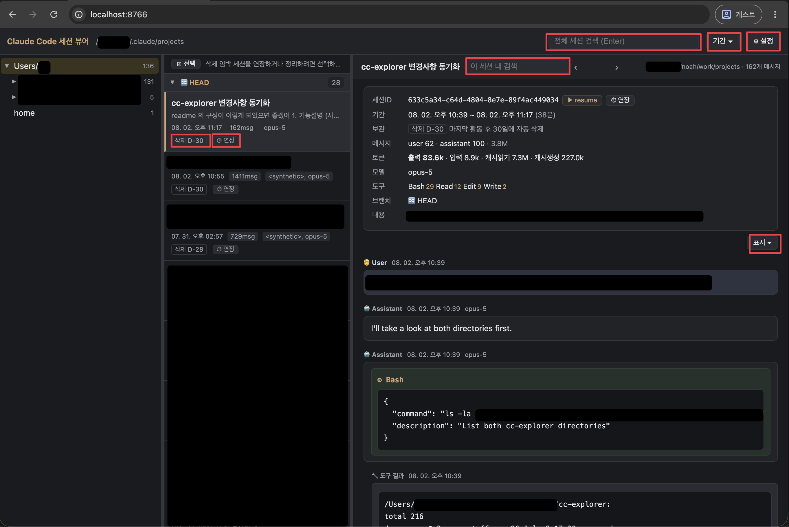
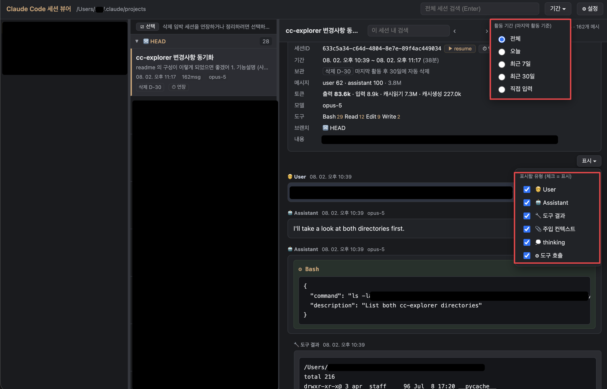
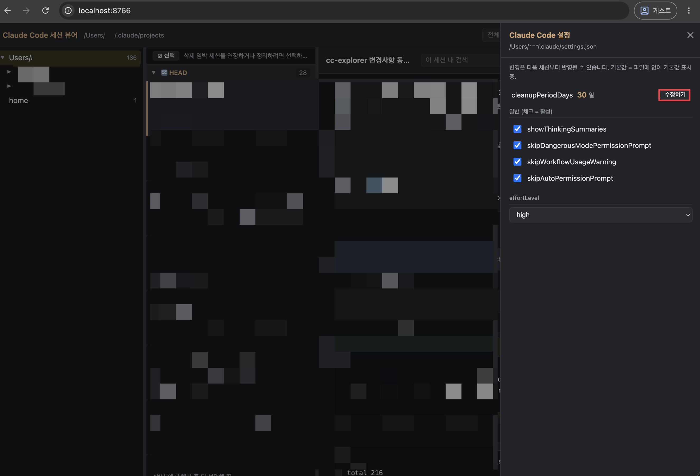

# cc-explorer — Claude Code 세션 뷰어

로컬에 쌓인 Claude Code 세션 기록(`~/.claude/projects/**/*.jsonl`)을 디렉토리 위계로 탐색하고,
대화 타임라인을 다시 읽고 · 검색하고 · 정리하는 로컬 웹앱.

- 파이썬 **표준 라이브러리만** 사용 — 설치할 패키지 없음
- `127.0.0.1` 에만 바인드, 외부 네트워크 호출 없음
- **대화 기록 내용은 수정하지 않는다** — 쓰기는 삭제 연장 · 삭제 · 설정 편집뿐
- macOS · Linux · Windows 동작

---

## 기능

### 1. 세션 탐색 · 검색



- **디렉토리 트리** — 세션이 실행된 실제 `cwd` 로 위계를 만든다. 프로젝트 단위로 좁혀 본다.
- **세션 목록** — 최근 활동순, git 브랜치(`🔀`)별 그룹. 제목 · 시각 · 메시지 수 · 모델 · `삭제 D-N` 배지.
- **분기 위계** — `/branch` 로 갈라진 세션을 부모 밑에 들여쓰기로 붙이고 `⑂ 분기` 태그를 단다.
  어느 세션에서 나온 갈래인지 목록에서 바로 보인다. 부모가 다른 브랜치·폴더에 있으면
  태그에 마우스를 올려 원본 세션 제목을 확인한다.
- **대화 타임라인** — 세션ID · 기간 · 토큰 · 사용 도구 요약과 함께 대화를 그대로 다시 읽는다.
- **전체 세션 검색** — 모든 세션 본문을 훑어 매칭 세션과 스니펫을 보여준다.
- **이 세션 내 검색** — 현재 세션에서 매칭을 하이라이트, `Enter` / `Shift+Enter` 로 이동.
- **▶ resume** — `cd '<cwd>' && claude -r '<세션ID>'` 를 클립보드에 복사해 그 세션을 이어간다.

### 2. 필터



- **기간 ▾** — 전체 / 오늘 / 최근 7일 / 최근 30일 / 직접 입력. 마지막 활동 기준이며
  목록 · 검색 결과 · 트리의 세션 수에 함께 적용된다.
- **표시 ▾** — 타임라인에 그릴 유형을 고른다:
  🧑 User · 🤖 Assistant · 🔧 도구 결과 · 📎 주입 컨텍스트 · 💭 thinking · ⚙ 도구 호출.
  도구 로그를 걷어내고 대화만 볼 때 쓴다.

### 3. 자동 삭제 관리 · 설정



Claude Code 는 시작할 때 `cleanupPeriodDays`(기본 30일)보다 오래된 세션 파일을 지운다
([문서](https://code.claude.com/docs/en/claude-directory#cleaned-up-automatically)).
따로 알려주지 않으므로, 남은 기간을 `삭제 D-N` 배지로 띄우고(3일 이하 빨강 · 7일 이하 노랑)
두 가지 방법으로 막는다.

- **⏱ 연장** — 그 세션의 시계만 리셋한다(내용은 그대로). 목록 카드와 타임라인 헤더에 있다.
  구현은 파일 mtime 을 현재로 갱신하는 방식이다.
- **⚙ 설정 → `cleanupPeriodDays`** — `수정하기` 로 기준 기간 자체를 늘린다(예: 30 → 180).
  모든 세션에 적용되고, 배지도 즉시 새 기준으로 다시 계산된다.

정리도 같은 화면에서 한다.

- **☑ 선택 → 🗑 삭제** — 하나만 체크하면 개별 삭제, 여러 개나 전체선택이면 일괄 삭제.
  확인 모달을 거쳐 **영구 삭제**된다(복구 불가). 세션 `.jsonl` 과 함께 사이드카 디렉토리
  (`<session>/subagents/`, `<session>/tool-results/`)도 같이 지운다.
- 설정 드로어에서 `showThinkingSummaries` 같은 boolean 과 `effortLevel` 도 편집할 수 있다.
  저장 전 `settings.json.bak` 백업을 남긴다.

---

## 설치

```bash
git clone https://github.com/Noaarhk/cc-explorer.git
cd cc-explorer
python3 install.py      # Windows: python install.py
```

전역 명령어가 등록되어 어디서든 실행할 수 있다.

```bash
cc-explorer
```

`http://127.0.0.1:8765/` 가 브라우저에서 자동으로 열린다(포트가 쓰이고 있으면 자동 증가).
`--no-open` 으로 자동 열기를 끄고, `Ctrl+C` 로 종료한다.

설치 없이 바로 실행해도 된다.

```bash
python3 server.py       # Windows: python server.py
```

> 요구사항은 Python 3.8+ 와 브라우저뿐이다.
> 레포를 다른 경로로 옮기면 링크가 깨지므로 `install.py` 를 다시 실행한다.

## 제거

```bash
python3 install.py --uninstall
```
